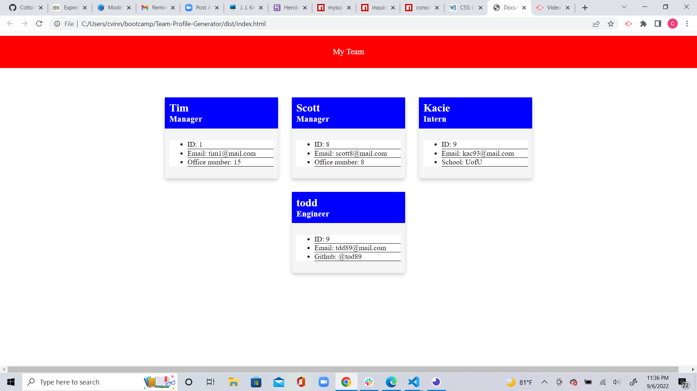

# Team Profile Generator
  ## Description

  This is n app that generates Employees from Manager, Engineer, and Intern. Using the command line in the terminal, the user will input whether the Employee is a Manager, Engineer or Intern and it will ask for their name, id, email, and officenumber for manager, github for Engineer and school for Intern. Once that input is put in it will generate an html presenting the card of the given Employee.
  
  ## Table of Contents
  
  - [Installation](#installation)
  - [Usage](#usage)
  - [Credits](#credits)
  - [License](#license)
  - [Badges](#badges)
  - [Features](#features)
  - [How to Contribute](#how_to_Contribute)
  - [Tests](#tests)

  ## Installation
  
  inquirer, and jest
  
  ## Usage
  
  It is used by running node index.js
  
  ## Credits
  
  Me
  
  ## License
  
  N/A
  
  ## Badges
  
  ## Features
  
  ## How to Contribute
  
  fork repository
  
  ## Tests

 there is four test files that passed when ran through jest.

 ## Screenshot of website

 

  
